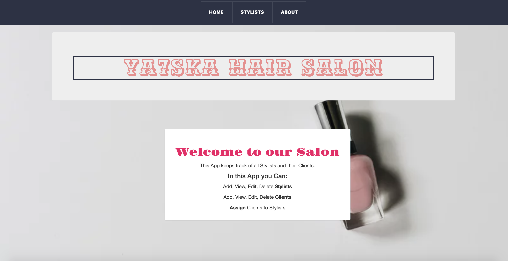
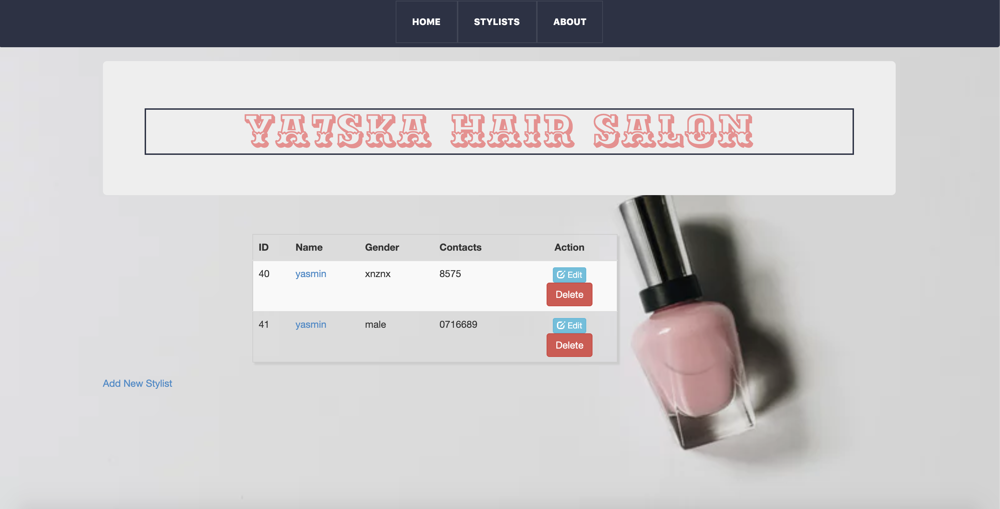
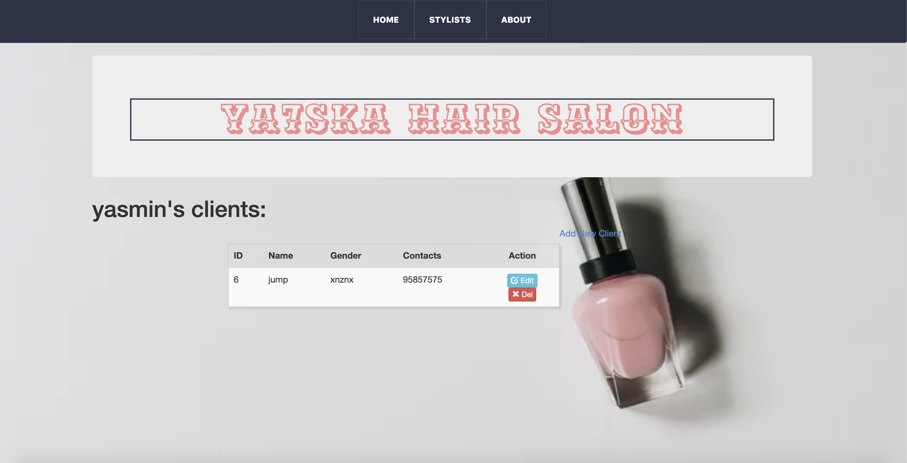

# HAIR SALON
#### Hair Salon, April 24th 2019
#### By **Yasmin Abdirahman**

## Description
-
An experiment in CRUD, Databases, and RESTful routing. As a user at a hair salon, you are be able to add a Stylist to a database and view their info, as well as add a Client to that stylist and also see their info. You are able to update the names of Stylists, and Clients, as well as completely Delete either.

## Setup/Installation requirements

* Download repository on github: https://github.com/ya7skaa/HairSalon
* Install Gradle https://gradle.org/
* Install PostgresSQL https://www.postgresql.org/
* In your computers Terminal application, type the command 'postgres'
* In another tab in the terminal type the command 'psql'
* In this same tab, type the command 'CREATE DATABASE hair_salon;', and then '\c hair_salon'
* In a third tab of terminal, navigate to your browsers download directory
* go into the hair-salon directory from github, and still in terminal, type the command 'psql hair_salon < hair_salon.sql'
*  now still in the hair_salon directory in terminal, execute the gradle command 'gradle run'
* A server will begin running. You may now exit the terminal and open a web browser of your choice.
* In the web browser, enter the URL 'localhost:3456' this will open the hair_salon page

## DataBase
In PSQL:
* `CREATE DATABASE hair_salon;`
* `CREATE TABLE stylists (id serial PRIMARY KEY, firstname varchar, lastname varchar, description varchar);`
* `CREATE TABLE clients (id serial PRIMARY KEY, firstname varchar, lastname varchar, notes varchar, stylistid integer);`

## Technologies Used
1. Java
2. Spark Micro-framework http://sparkjava.com/
3. Velocity Template Engine
4.Gradle used to manage dependencies https://gradle.org/
5.Junit for testing Java backend http://junit.org/junit4/
6. PostgreSQL https://www.postgresql.org/
7  HTML
8. CSS

## Known Bugs
- A few of the bugs is the edit feature for the stylists isn't functional as well as the delete feature for the clients list.
Other than that no other bugs detected.

## Support and Contact Details
- For any comments,suggestions,feedback or inquiries, contact me via email: `yaazzmineoz@gmail.com`

- Make contributions to the code.

## License
- This project is licensed under the MIT Open Source license (https://opensource.org/licenses/MIT) Copyright (c) 2019. [Yasmin Abdirahman](https://github.com/ya7skaa)
